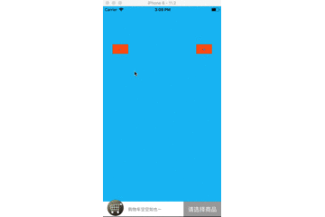

# XCShoppingCart

[](https://travis-ci.org/fanxiaocong/XCShoppingCart)
[](https://cocoapods.org/pods/XCShoppingCart)
[](https://cocoapods.org/pods/XCShoppingCart)
[](https://cocoapods.org/pods/XCShoppingCart)
[](https://www.apple.com/nl/ios/)&nbsp;


***
|Author|小小聪明屋|
|---|---|
|E-mail|1016697223@qq.com|
|GitHub|https://github.com/fanxiaocong|
|Blog|http://www.cnblogs.com/fanxiaocong|
***


## Example

简单封装购物车的UI页面，使用简单，方便集成。





创建购物车视图并添加到当前视图上

```objc
XCShoppingCartBar *cartBar = [[XCShoppingCartBar alloc] initWithFrame:CGRectMake(0, CGRectGetHeight(self.view.bounds) - 50, CGRectGetWidth(self.view.bounds), 50)];
// 点击购物车按钮的回调
[cartBar.cartButton addTarget:self action:@selector(didClickCartButtonAction) forControlEvents:UIControlEventTouchUpInside];
// 点击确认按钮的回调
[cartBar.enterButton addTarget:self action:@selector(didClickEnterButtonAction) forControlEvents:UIControlEventTouchUpInside];
self.cartBar = cartBar;
[self.view addSubview:cartBar];
```

配置购物车列表的单元格

```objc
// 配置cell
self.cartBar.listView.cellForRowAtIndex = ^UITableViewCell *(XCShoppingCartListView *listView, UITableView *tableView, NSInteger index) {
    static NSString *cellID = @"cellID";
    UITableViewCell *cell = [tableView dequeueReusableCellWithIdentifier:cellID];
    if (!cell) {
        cell = [[UITableViewCell alloc] initWithStyle:UITableViewCellStyleDefault reuseIdentifier:cellID];
    }
    cell.textLabel.text = listView.dataSource[index];
    return cell;
};
```

添加商品到购物车中，此处只是模拟加入购物车的动画，实际项目中展示的数据需要根据具体的需求来进行设置

```objc
CGPoint fromCenter = [sender.superview convertPoint:sender.center toView:[UIApplication sharedApplication].keyWindow];
CGPoint toCenter = [self.cartBar.cartButton.superview convertPoint:self.cartBar.cartButton.center toView:[UIApplication sharedApplication].keyWindow];
    
CALayer *layer = [CALayer layer];
layer.bounds = CGRectMake(0, 0, 30, 30);
layer.position = fromCenter;
layer.backgroundColor = [UIColor redColor].CGColor;
    
[[UIApplication sharedApplication].keyWindow.layer addSublayer:layer];
    
CAAnimation *animation = [XCShoppingCartAnimation throwAnimationFromPoint:fromCenter toPoint:CGPointMake(toCenter.x, toCenter.y)];
[layer addAnimation:animation forKey:nil];
    
/// 动画结束后移除对应的图层
[layer performSelector:@selector(removeFromSuperlayer) withObject:nil afterDelay:.8f];
    
self.cartBar.badgeNumber ++;
[self.cartBar.listView.dataSource addObject:@(self.cartBar.badgeNumber).description];
self.cartBar.priceLabel.text = @"总价：¥100";
/// 当数据源改变之后需要刷新UI
[self.cartBar refreshUI];
```

减少购物车中的商品的数量

```objc
/**
 *  占击减号按钮的回调
 */
- (IBAction)didClickMinusButtonAction:(id)sender
{
    self.cartBar.badgeNumber --;
    [self.cartBar.listView.dataSource removeLastObject];
    [self.cartBar refreshUI];
}
```

打开购物车

```objc
self.cartBar.open = YES;
```

关闭购物车

```objc
self.cartBar.open = NO;
```


## Installation

### CocoaPods
```objc
pod 'XCShoppingCart'
```
